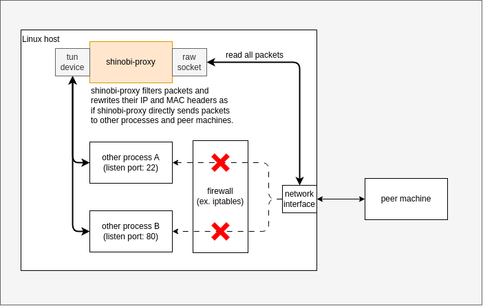

# shinobi-proxy
shinobi-proxy is proxy app for getting over firewall. You can ignore filters of inbound packets by firewall in the Linux host on which shinobi-proxy is runnning. It's just a funny tool :) I'm glad for you to play this app. Thank you!

## what is shinobi-proxy?
shinobi-proxy read packets directly from network interfaces by rawsocket, and send them through TUN device to inner processes on the Linux host which shinobi-proxy is running on, as if shinobi-proxy send packets to inner process directly. Rawsocket is not affected by filters of firewalls, so even if the Linux host drop packets by the firewall rules, shinobi-proxy can read the packets and send to the inner processes.



## let's play with docker
You can play a scenario in which you can use SSH and access to a Linux docker container that enables firewall and drop any packets. Please process the bellow "container operation" and sometimes need to do "host machine operation".

### container operation
```shell
# please open a new terminal on the host machine
# create ssh server container
docker run --privileged --rm -e PASSWORD_ACCESS=true -e SUDO_ACCESS=true -e USER_PASSWORD=p -it linuxserver/openssh-server bash

# download shinobi-proxy
# 1. base image is alpine, so it needs to install libc
apk add libc6-compat

# 2-a. download shinobi-proxy if you use x86_64
wget https://github.com/tomatod/shinobi-proxy/releases/download/v0.1.0/shinobi-proxy-x86_64
mv shinobi-proxy-x86_64 shinobi-proxy
chmod +x shinobi-proxy

# 2-b. download shinobi-proxy if you use arm64
wget https://github.com/tomatod/shinobi-proxy/releases/download/v0.1.0/shinobi-proxy-arm_64
mv shinobi-proxy-arm_64 shinobi-proxy
chmod +x shinobi-proxy

### please try the bellow "host machine operation" -> you can access to this container :)

# install iptables and add DROP rule which drop any request
# NIC's name of the container may not be eth0. In that case, please change it according to your environment.
apk add iptables
iptables -A INPUT -i eth0 -j DROP
iptables -A OUTPUT -o eth0 -j DROP

### please try the bellow "host machine operation" -> you cannot access to this container :(

# run shinobi-proxy
# <IP address> is the IP of host machine'NIC for docker network
# NIC's name of the container may not be eth0. In that case, please change it according to your environment.
./shinobi-proxy -e eth0 -p 2222 -r <IP address> -t TCP

### please try the bellow "host machine operation" -> you can access to this container again :)
```

### host machine operation
```shell
# connect to the ssh server container from host machine. password is 'p'
# <IP address> is the IP of container's NIC
ssh linuxserver.io@<IP address> -p 2222
```
